# Credit Risk
__David Yang__  
This is a dataset that I found online about credit risk since it is my first time seeing a dataset that's related to risk, I decided to do a quick analysis on it. I am going to do some explorations through the Credit Risk to understand the distributions and patterns within.

## Introduction
The original dataset contains 1000 entries with 20 categorial/symbolic attributes prepared by Prof. Hofmann. In this dataset, each entry represents a person who takes a credit by a bank. Each person is classified as good or bad credit risks according to the set of attributes. The link to the original dataset can be found below.  
  
Due to its complicated system of categories and symbols, several columns are simply ignored, because in my opinion either they are not important or their descriptions are obscure. The selected attributes are:  
__Age__ (Numeric)  
__Sex__ (Text: male, female)  
__Job__ (Numeric: 
0 - unskilled and non-resident, 
1 - unskilled and resident, 
2 - skilled, 
3 - highly skilled)  
__Housing__ (Text: own, rent, or free)    
__Saving accounts__ (Text - little, moderate, quite rich, rich)  
__Checking account__ (Numeric, in DM - Deutsch Mark)  
__Credit amount__ (Numeric, in DM)  
__Duration__ (Numeric, in month)  
__Purpose__(Text: car, furniture/equipment, radio/TV, domestic appliances, repairs, education, business, vacation/others  
__Risk__ (Value target - Good or Bad Risk)  

## Setting up Library/Import Dataset
```python
import pandas as pd
import numpy as np
import seaborn as sns
import matplotlib.pyplot as plt

#Importing the data
df_credit = pd.read_csv("credit_data.csv",index_col=0)
```
## Quick look at the data
- Data type for each columns
- Null
- Unique Values
- Overview
```python
#Checking info of the data
print(df_credit.info())
#Looking unique values
print(df_credit.nunique())
#Looking the data
print(df_credit.head())
```
## Exploring the data
Let's start looking through target variable and their distribuition.
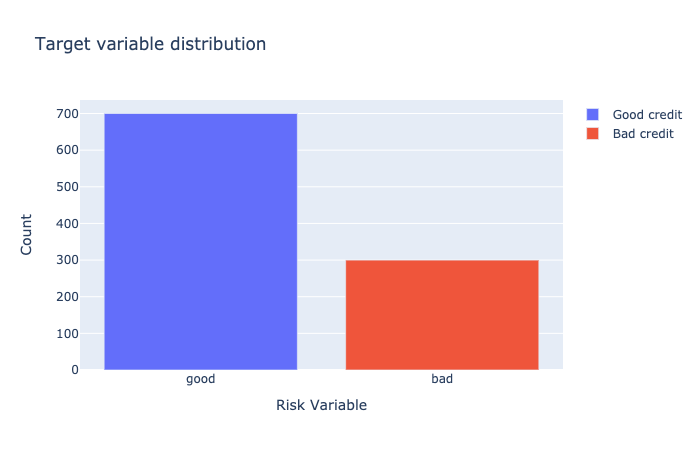
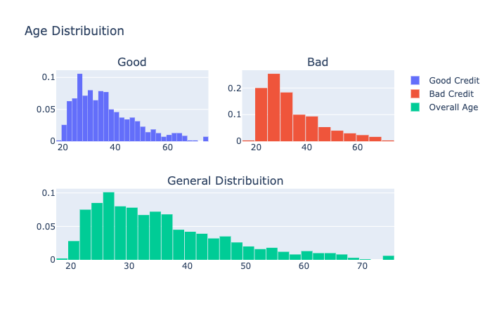
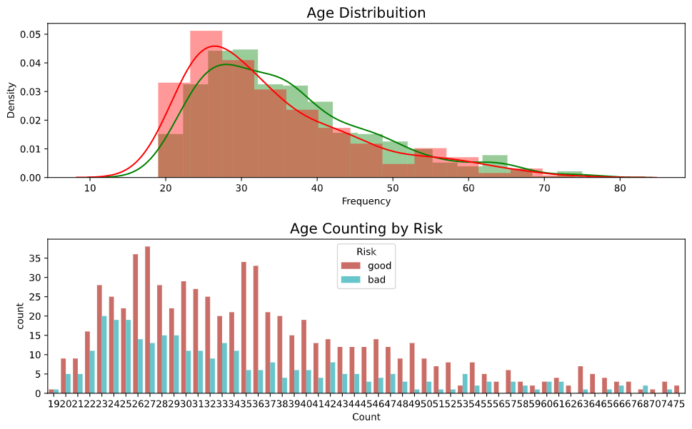
  
Creating an categorical variable to handle with the Age variable.
```python
#Let's look the Credit Amount column
interval = (18, 25, 35, 60, 120)

cats = ['Student', 'Young', 'Adult', 'Senior']
df_credit["Age_cat"] = pd.cut(df_credit.Age, interval, labels=cats)

df_good = df_credit[df_credit["Risk"] == 'good']
df_bad = df_credit[df_credit["Risk"] == 'bad']
```
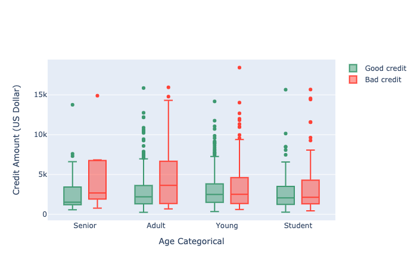

I will now look at the distribuition of Housing own and rent by Risk.

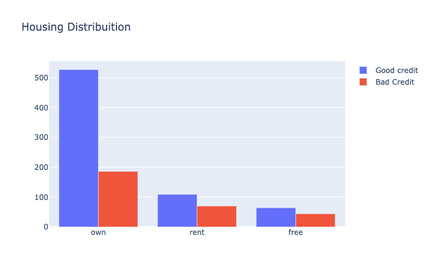

Now we can see that the own and good risk have a high correlation.

___Distribuition of Credit Amount by Housing___


Interesting moviments! Highest values come from category "free" and we have a different distribuition by Risk.

___Looking the diference by Sex___

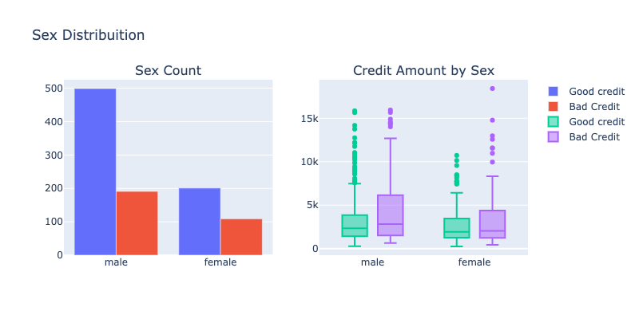

I am going to create categories of Age and look the distribuition of Credit Amount by Risk... and do some explorations through the Job.
- Distribuition
- Crossed by Credit amount
- Crossed by Age

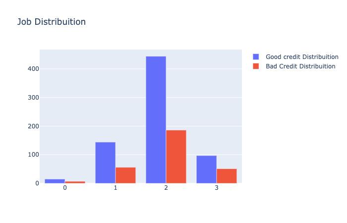
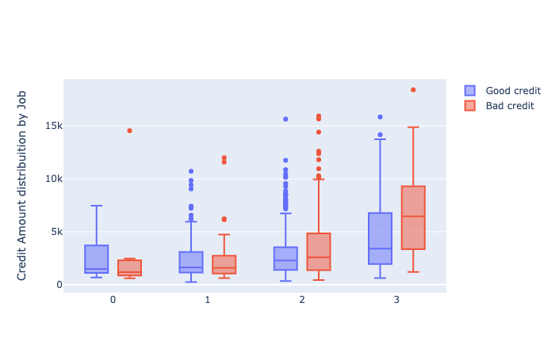
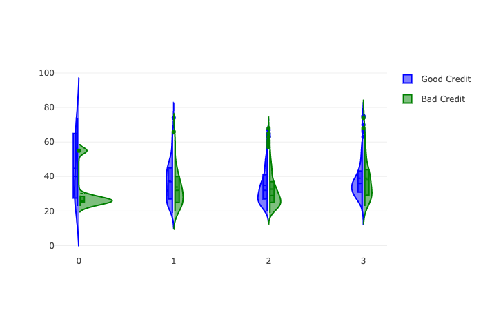
__Job Type reference x Age__
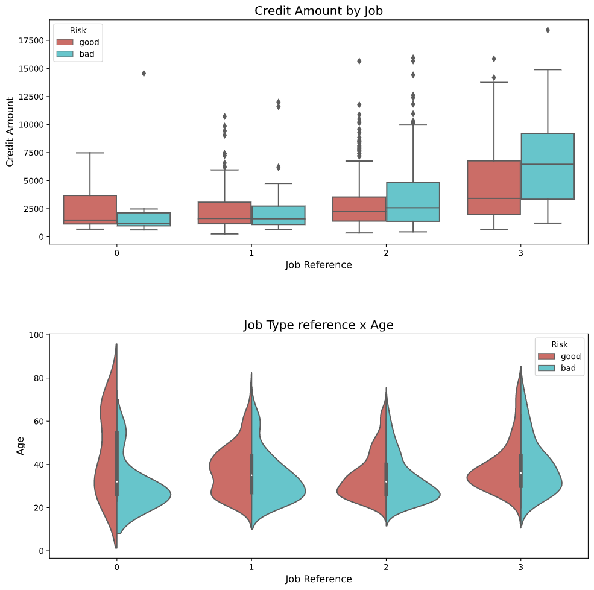

__Distrubution of Credit Amount__
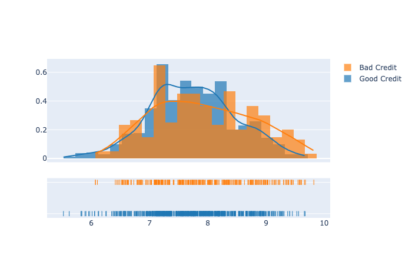
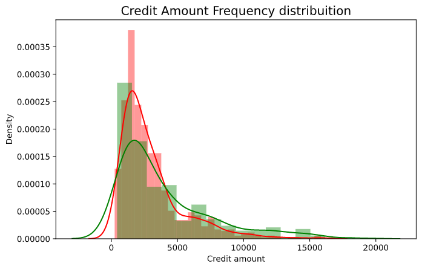

__Distrubution of Saving accounts by Risk__
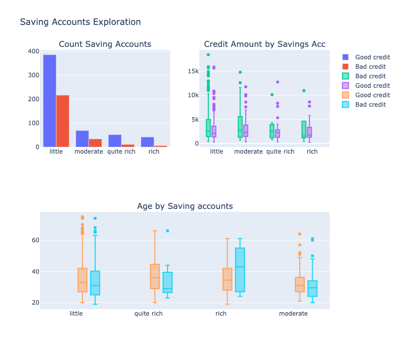
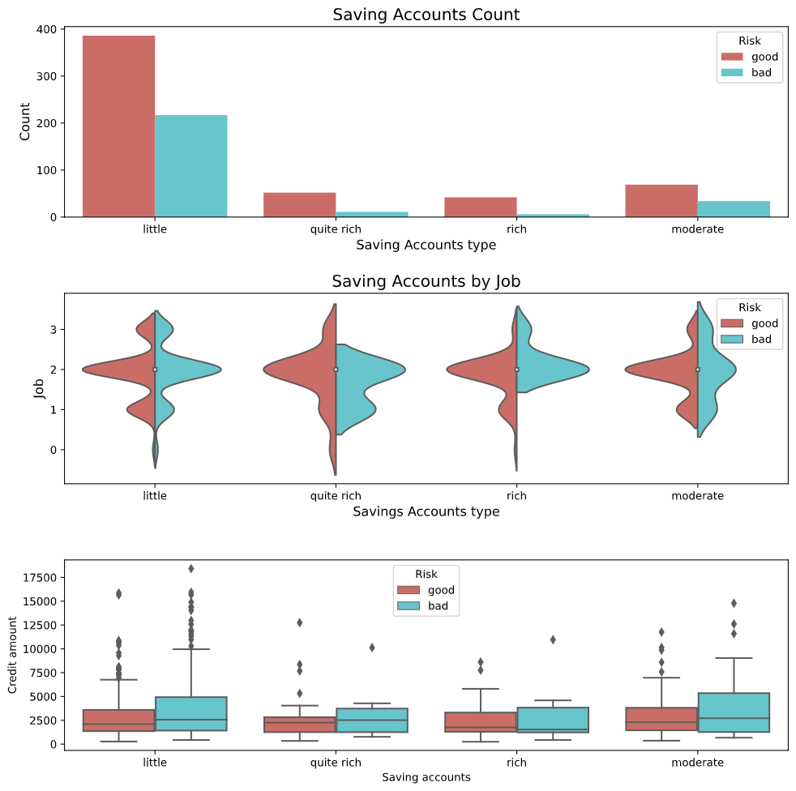
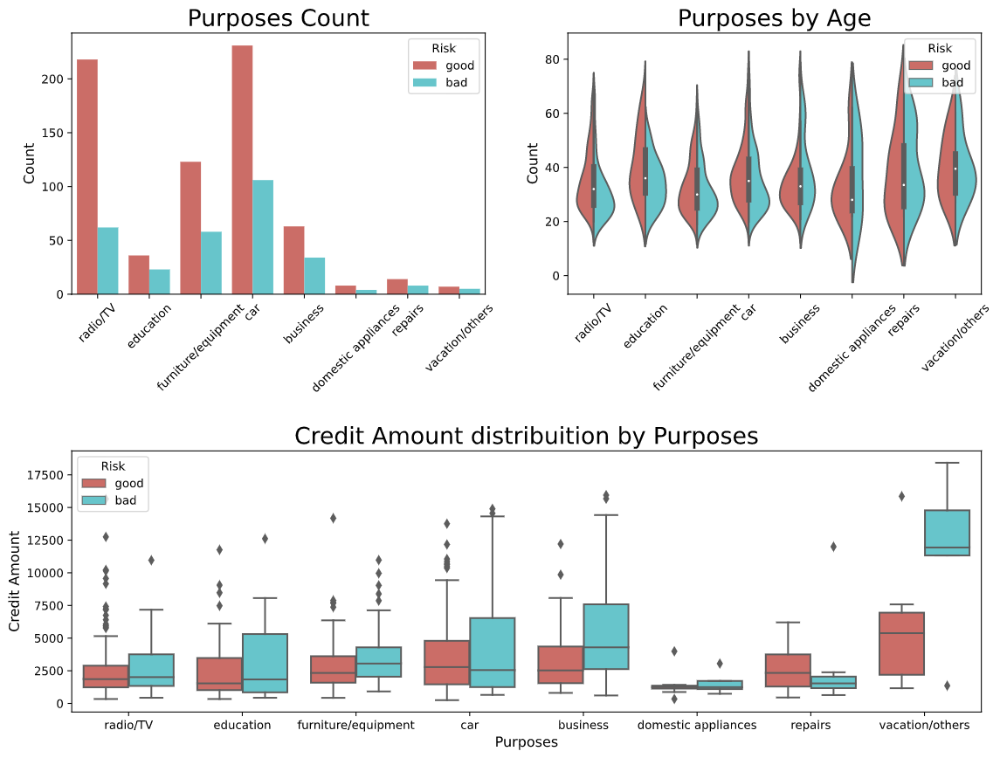

```python
print("Values describe: ")
print(pd.crosstab(df_credit.Purpose, df_credit.Risk))
```

__Duration of the loans distribuition and density__
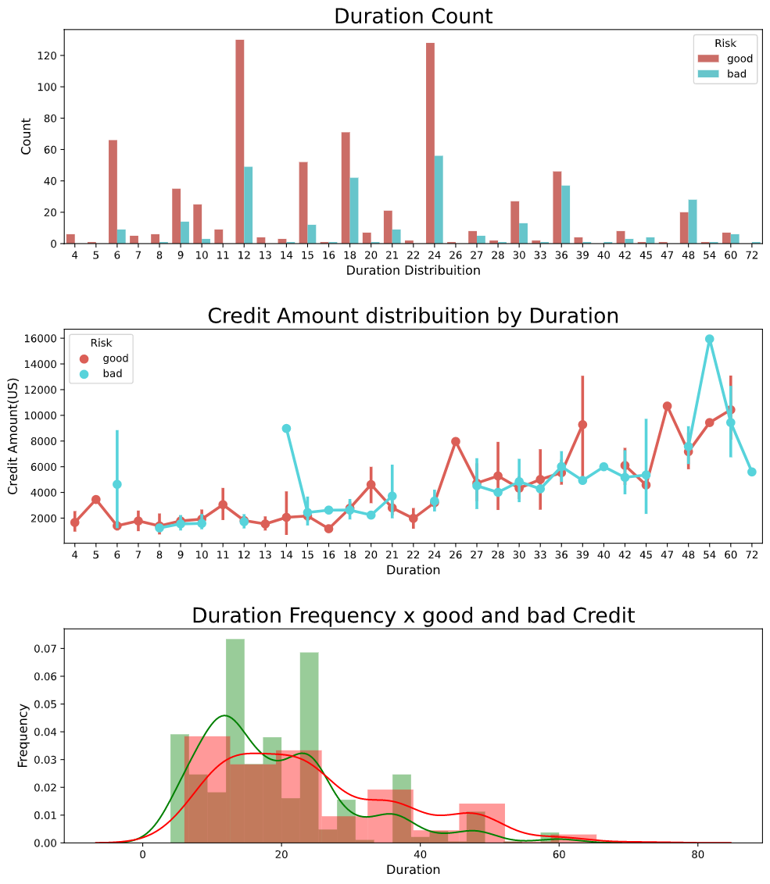
we can see that the highest duration have the high amounts.
The highest density is between [12 ~ 18 ~ 24] months
It all make sense.

